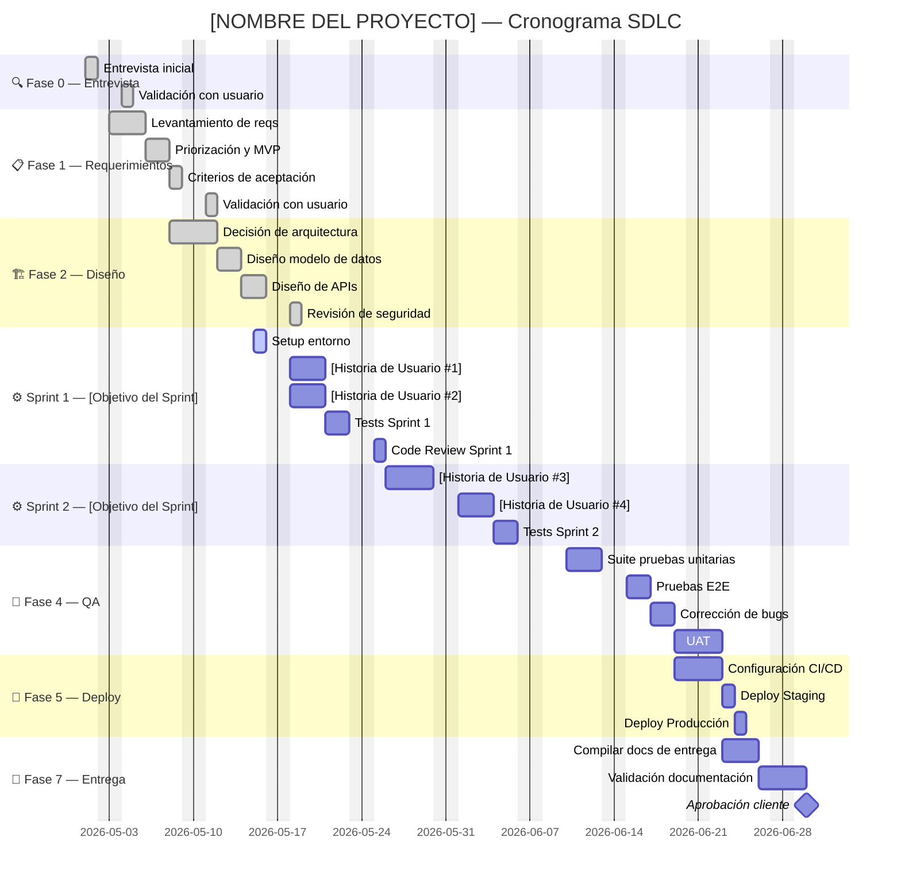

# GENERADOR DE GANTT — Automático y Siempre Sincronizado
> El agente genera y actualiza el Gantt automáticamente.
> Se regenera en cada evento relevante sin que el usuario lo pida.
> Formato: Markdown con bloques Mermaid (compatible con GitHub, Notion, Obsidian y cualquier CLI).

---

## CUÁNDO SE GENERA O ACTUALIZA EL GANTT

El agente regenera el Gantt automáticamente cuando ocurre cualquiera de estos eventos:

```
TRIGGERS DE ACTUALIZACIÓN DEL GANTT
│
├── Al cerrar la Fase 0 (entrevista) → genera Gantt inicial completo
├── Al iniciar un Sprint              → agrega el sprint al Gantt
├── Al cerrar un Sprint               → marca el sprint como completado
├── Al cerrar una Subfase             → marca la subfase como completada
├── Al detectar un fallo              → ajusta fechas estimadas afectadas
├── Al agregar un nuevo requerimiento → agrega tareas al Gantt
├── Al cambiar una prioridad          → reordena el Gantt
├── Al hacer deploy                   → marca el hito de release
└── Cuando el usuario dice "gantt" / "diagrama" / "cronograma"
```

El archivo se guarda en: `docs/progress/gantt-[nombre-proyecto].md`
Se actualiza IN PLACE — no se crean múltiples versiones.

---

## ESTRUCTURA DEL GANTT

El Gantt tiene tres niveles de granularidad:

```
Nivel 1: Fases      (Fase 0 a Fase 7)
Nivel 2: Sprints    (Sprint 1, Sprint 2... dentro de cada fase)
Nivel 3: Subfases   (1.1, 1.2... las tareas dentro de cada sprint)
```

---

## FORMATO DE SALIDA — MERMAID GANTT

El agente genera el Gantt en formato Mermaid, que se renderiza visualmente en GitHub,
Notion, Obsidian, GitLab, y la mayoría de herramientas modernas.

### Plantilla base



### Estados de las tareas en Mermaid

| Estado | Código Mermaid | Significado |
|--------|---------------|-------------|
| Completada | `:done,` | Cerrada y validada |
| En progreso | `:active,` | Subfase actual |
| Bloqueada | `:crit,` | Tiene un fallo activo |
| Pendiente | `:` (sin estado) | Planificada, no iniciada |
| Hito | `:milestone,` | Evento puntual (release, entrega) |

---

## CÓMO EL AGENTE GENERA EL GANTT

### Al inicio del proyecto (Fase 0 → Fase 1)

```
GENERACIÓN INICIAL DEL GANTT
━━━━━━━━━━━━━━━━━━━━━━━━━━━━━━━━━━━━━━━━━
1. Leer project-context.md para obtener:
   - Nombre del proyecto
   - Fecha de inicio
   - Metodología (Scrum / Kanban / Scrumban)
   - Fases activas según config/framework.yml
   - User stories priorizadas del backlog

2. Calcular fechas estimadas:
   - Fase 0-1: 1 semana promedio
   - Fase 2: 1-2 semanas según complejidad
   - Por cada Sprint: duración definida por el usuario (1-4 semanas)
   - Fase 4 QA: 1 semana por cada 2 sprints de desarrollo
   - Fase 5 Deploy: 3-5 días
   - Fase 7: 1 semana

3. Generar bloque Mermaid completo
4. Guardar en docs/progress/gantt-[nombre].md
5. Reportar al usuario: "Gantt generado en docs/progress/gantt-[nombre].md"
━━━━━━━━━━━━━━━━━━━━━━━━━━━━━━━━━━━━━━━━━
```

### Al iniciar cada Sprint

```
ACTUALIZACIÓN AL INICIAR SPRINT [N]
━━━━━━━━━━━━━━━━━━━━━━━━━━━━━━━━━━━
1. Agregar sección "Sprint [N] — [Objetivo]" al Gantt
2. Listar cada historia seleccionada como tarea `:active,`
3. Calcular fechas reales (inicio del sprint) en vez de estimadas
4. Guardar y notificar
━━━━━━━━━━━━━━━━━━━━━━━━━━━━━━━━━━━
```

### Al cerrar una Subfase o Sprint

```
ACTUALIZACIÓN AL CERRAR SUBFASE/SPRINT
━━━━━━━━━━━━━━━━━━━━━━━━━━━━━━━━━━━━━━
1. Cambiar el estado de las tareas cerradas a `:done,`
2. Si hubo retrasos: ajustar fechas de tareas siguientes
3. Si hubo fallos: marcar con `:crit,` y ajustar timeline
4. Actualizar fecha de los hitos siguientes si se corrió el timeline
5. Guardar y notificar si hubo cambios relevantes en el cronograma
━━━━━━━━━━━━━━━━━━━━━━━━━━━━━━━━━━━━━━
```

### Cuando se detecta un fallo o retraso

```
AJUSTE DE GANTT POR FALLO/RETRASO
━━━━━━━━━━━━━━━━━━━━━━━━━━━━━━━━━
1. Marcar la tarea afectada como `:crit,` (bloqueada)
2. Calcular impacto en cascada sobre tareas dependientes
3. Ajustar fechas estimadas hacia adelante
4. Mostrar al usuario el delta: "El retraso mueve la fecha de entrega de [X] a [Y]"
5. Guardar el Gantt actualizado
━━━━━━━━━━━━━━━━━━━━━━━━━━━━━━━━━
```

---

## FORMATO DEL ARCHIVO GANTT

El archivo `gantt-[nombre].md` tiene esta estructura:

```markdown
# Gantt — [Nombre del Proyecto]
> Última actualización: [fecha]
> Estado: [Fase actual] | Sprint [N] | [N]% completado

## Vista General

[bloque mermaid con el gantt completo]

## Resumen de Estado

| Fase | Estado | Inicio | Fin Real/Estimado | Retrasos |
|------|--------|--------|-------------------|----------|
| Fase 0 — Entrevista      | ✅ Completa | DD/MM | DD/MM | Ninguno |
| Fase 1 — Requerimientos  | ✅ Completa | DD/MM | DD/MM | Ninguno |
| Fase 2 — Diseño          | 🔄 En progreso | DD/MM | DD/MM (est.) | N/A |
| Sprint 1                 | ⬜ Pendiente | DD/MM (est.) | DD/MM (est.) | N/A |
| ...                      | ... | ... | ... | ... |

## Hitos Clave

| Hito | Fecha Estimada | Estado |
|------|---------------|--------|
| MVP listo para QA       | DD/MM/YYYY | ⬜ Pendiente |
| Deploy en Staging       | DD/MM/YYYY | ⬜ Pendiente |
| Entrega al cliente      | DD/MM/YYYY | ⬜ Pendiente |

## Historial de Cambios al Cronograma

| Fecha | Motivo | Impacto |
|-------|--------|---------|
| [fecha] | [fallo/nuevo req/cambio] | [fechas corridas N días] |
```

---

## INTEGRACIÓN CON EL PIPELINE DE 8 PASOS

El Gantt forma parte del PASO 7 (Registro y Sincronización):

```
PASO 7 — REGISTRO Y SINCRONIZACIÓN
  ...
  [ ] Gantt actualizado en docs/progress/gantt-[nombre].md
        - Tareas completadas → marcadas :done,
        - Fallos detectados → marcadas :crit,
        - Fechas ajustadas si hubo retrasos
  ...
```

**El Gantt desactualizado = desincronización = bucle de calidad ABIERTO.**

---

## COMANDO RÁPIDO

Cuando el usuario diga: **"muéstrame el gantt"** / **"cronograma"** / **"cómo vamos en tiempo"**

El agente responde con:
1. El bloque Mermaid actualizado (renderizable en GitHub/Notion)
2. El resumen de estado en tabla
3. Los hitos clave con fechas
4. Si hay retrasos: el delta y la nueva fecha estimada de entrega
